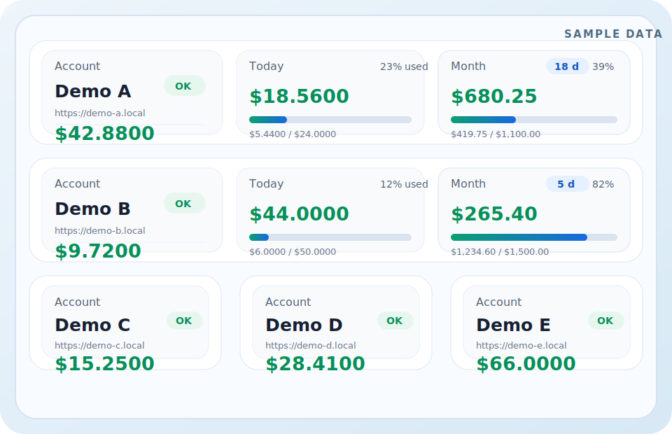

# Sub2API Quota Widget

一个本地运行的 Sub2API 账号额度面板，包含完整网页面板和 Windows 桌面挂件模式。

> 下方效果图使用的是示例数据，不包含任何真实账号、域名、余额、token 或密码。



## 功能

- 本地网页面板：新增、编辑、删除账号，并手动刷新额度。
- 桌面挂件：透明无边框窗口，固定显示账号余额、今日余额、本月余额等信息。
- 自动刷新：默认每 60 秒刷新一次账号数据。
- 本地存储：账号、token、登录邮箱和密码只保存在本机 `data/accounts.json`。
- 隐私优先：不包含统计、云同步或任何预置个人账号数据。

## 安装

```powershell
npm.cmd install
```

## 启动网页面板

```powershell
npm.cmd start
```

然后打开：

```text
http://127.0.0.1:3847/
```

## 启动桌面挂件

```powershell
npm.cmd run desktop
```

也可以运行：

```powershell
powershell -NoProfile -ExecutionPolicy Bypass -File .\scripts\start-desktop.ps1
```

## 环境变量

```text
HOST=127.0.0.1
PORT=3847
```

## 数据和隐私

- 真实账号数据会写入 `data/accounts.json`。
- `data/` 已加入 `.gitignore`，不要提交到公开仓库。
- 请不要提交迁移包、桌面设置、日志文件或 `.env`。
- 返回给前端的账号数据会隐藏 access token 和 refresh token，但本地数据文件仍包含敏感凭据。

## 项目结构

```text
desktop/   Electron 桌面壳
public/    前端页面和样式
server/    本地 HTTP 服务和 Sub2API 请求逻辑
scripts/   Windows 启动辅助脚本
assets/    图标和 README 效果图
```

## License

MIT
